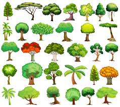
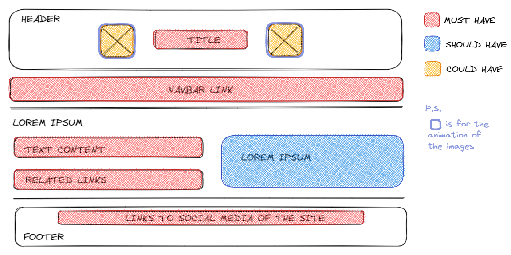

# All About Trees

> - All about Trees focuses on caring and spreading information about our planet
>   and trees on it.
> - Trees are the most important thing for our environment. Its our OXYGEN
>   resource!!
> - Here you can get all information about trees and how to keep them alive.

## Table of contents

- [All About Trees](#all-about-trees)
  - [Table of contents](#table-of-contents)
  - [General info](#general-info)
  - [Screenshots](#screenshots)
  - [Technologies](#technologies)
  - [Setup](#setup)
  - [Features](#features)
    - [To-do list](#to-do-list)
  - [Status](#status)
  - [Team Members](#team-members)

## General info

> All about Trees will give you links were you can learn everything about trees.
> You will find diagram, articles, videos and many more extra information. You
> will also have links to our social media contact information.

## Screenshots

## Technologies

- Agile development method
- VSC code
- HTML
- CSS
- Markdown

## Setup

- Create our group repository
- Each member clone the repository
- run `npm install`
- Discuss about planning and how to work on the project
- Create and update the planning
- Define the tasks and create issues for it
- Add HTML and CSS codes
- Run all the CI checks

## Features

Heading

- Title
- logo

Main section

- Introduction
- Main info
- Side extra info

Footer

- Links to social media accounts

### To-do list

- Complete the codes
- Use CSS to make website prettier

## Status

Project is: _in progress_

## Team Members

- Hsia
- Mervat
- Juan
