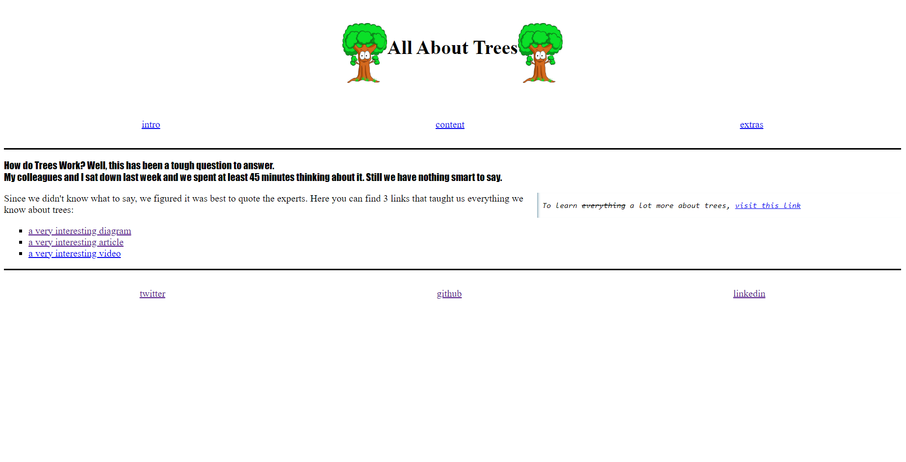

# All About Trees

> All about Trees is about caring about our planet and trees are the most
> important thing for our environment. Its our OXYGEN resource!! Here you can
> get all information about trees and how to keep them alive.

## Table of contents

- [All About Trees](#all-about-trees)
  - [Table of contents](#table-of-contents)
  - [General info](#general-info)
  - [Screenshots](#screenshots)
  - [Features](#features)
  - [Status](#status)
  - [Inspiration](#inspiration)
  - [Contact](#contact)
  - [Instructions for use](#instructions-for-use)

## General info

> To be add.

## Screenshots

<!--  -->

## Features

List of features ready and Todos for future development

- Useful links to planting tutorials
- Reference images about endangered type of trees.
-
-

To-do list:

-
-
-

## Status

Project is: _in progress_

## Inspiration

Project by freeCodeCamp.org

## Contact

By [Name]

## Instructions for use

  
Getting Started

