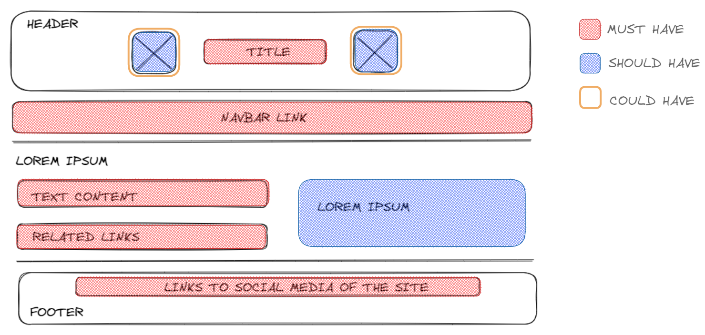

# Design

We decided to have a simple page, so we haven't decided on the colors and styles
but we will add them later. For the moment, we are trying to copy the example
site with reverse engineering.

- Red area - must have
- Blue area - should have
- Yellow area - could have

## Elements

- Header
- Navbar
- Main section
- Footer

---

